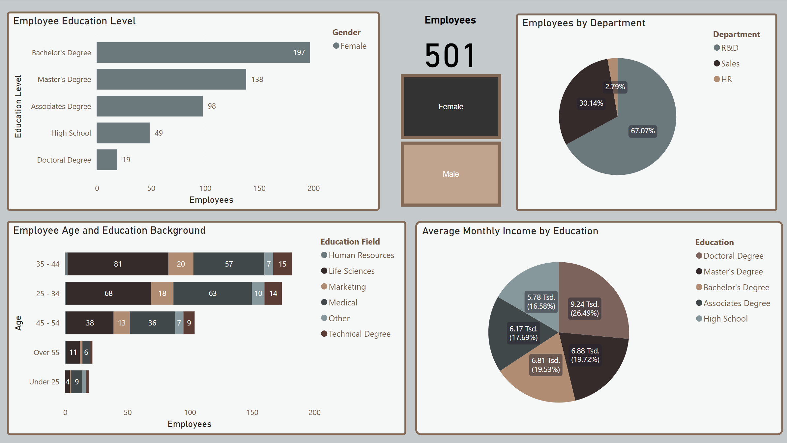
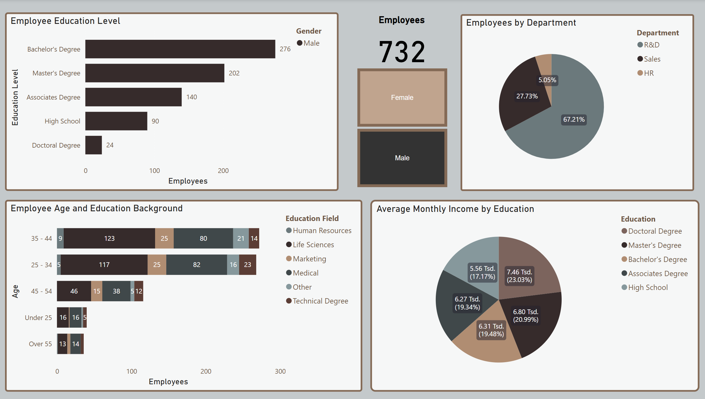

[Back](https://ycvogt.github.io/my_portfolio/)

# Data Analysis and Visualization in MS PowerBI

### Human Resources Dashboard

*Goal*: The goal of this dashboard was to visualize trends in the data along
the variables gender, education, education background, age and monthly income. The dataset for this dashboard was provided on Kaggle [1]. 

*Analysis*: Analysis will follow.

Sources:
[1] Smithens, Johnathan. https://www.kaggle.com/datasets/jonathansmithern/hr-analytics-dashboard (last accessed January 2025)

[Back](https://ycvogt.github.io/my_portfolio/)
