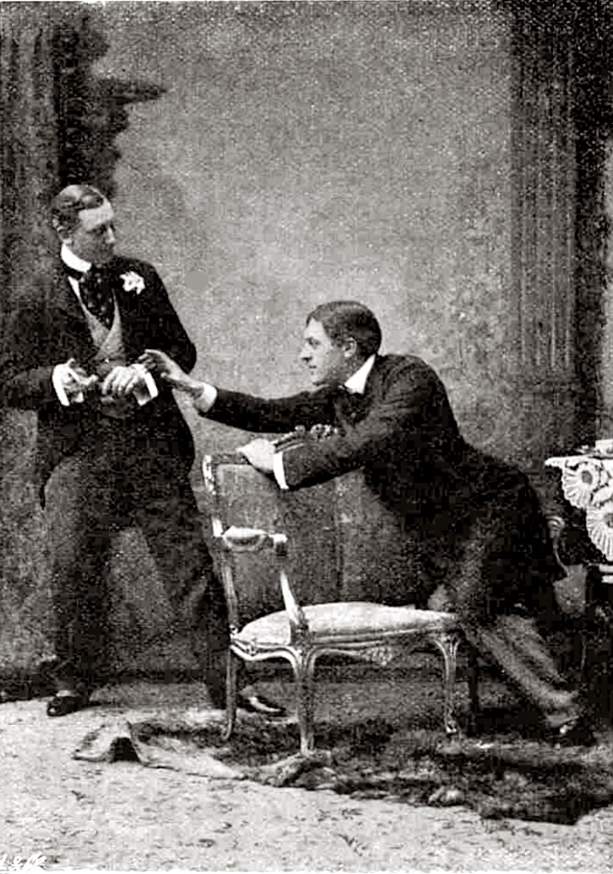

[Back](https://ycvogt.github.io/my_portfolio/)


# The Importance of Being Earnest: A Quantitative Text Analysis

The aim of this project was to automatically dissect and clean the dramatic text _The Importance of Being Earnest_ by Oscar Wilde (downloaded from _Project Gutenberg_) in order to quantify the speech acts and word counts per character overall and per act. 

**Skills**: textual data cleaning, structuring, tokenization, visualization <br>
**Libraries**: SpaCy, Regex, Pandas, Numpy, Matplotlib, Bokeh

---
### 1. Preprocessing of text data

After downloading the file from Project Gutenberg and deleting the Front/Back Matter content, I open and read the file. Then I dissect the text automatially into acts: 

```python
all_lines_act = []
next_lines_act = []

with open("Wilde_ImportanceEarnest.txt", "r", encoding="utf-8") as f: 
  for line in f:                     #read in file line by line
    if line.endswith("ACT\n"):       #identify pattern of new act
      next_lines_act = []            #reset act list for next act
    next_lines_act.append(line)      #collect act lines
    if line.endswith("ACT\n"):       #when new act starts, add previous lines to long list
      all_lines_act.append(next_lines_act)
```

... and into speech acts per speaker:

```python
all_lines = []
next_lines = []
act_lines = []

for act in all_lines_act:
  all_lines=[]                                  #reset for next act
  for item in act:
    if item.isupper() and item.endswith(".\n"): #identify the pattern of new speaker
      next_lines = []                           #empty the previous list
    next_lines.append(item)                     #add lines of speaker
    if item.isupper() and item.endswith(".\n"): #when a new speaker starts, add the previous speech
      all_lines.append(next_lines)
  act_lines.append(all_lines)                    #collect all speech acts for this act
```
With this, we can already determine the speech act number (n=3): 

```python
len(act_lines)
```

Next, we need to clean the list (e.g. get rid of new-line characters, punctuation, stage directions or trailing empty spaces) and restructure it to make it more managable. The output is a list with tuples, which contain the speaker (character name), the tokenized and cleaned speech act as a list of strings, and a digit indicating the act number.

```python
speech_list = []
string = r"\[.+\]"

for i, act in enumerate(act_lines, 1):

  for speech_act in act:
    speech_tokens = []

    speaker = speech_act[0]   #separating away the speaker now, as this helps with two-token names e.g. Lady Bracknell, instead of doing this later
    speaker = speaker.split(".\n")[0] #getting rid of the period and

    speech = speech_act[1:]   #the actual speech
    speech = " ".join(speech)
    new_speech = re.sub(string, "", speech) #this gets rid of directives and other descriptions in square brackets

    doc = nlp(new_speech) #filtering out certain tokens such as spaces, punctuation, empty lines
    for token in doc:
      if token.text != "\n":
        if not token.is_space:
          if not token.is_punct:
            if token.text != "":
              speech_tokens.append(token.text)
    speech_speaker = (speaker, speech_tokens, i)
    speech_list.append(speech_speaker)
```
Now we can represent the entire text as a dataframe, which helps with filtering for and quantifying specific conditions.

### 2. Analysing textual data in pandas:

We convert the list into a dataframe with the columns "Character", "Speech", "Act". Then we count the words for each row in column "Speech" and add the count as a separate column with the name "Word Count".

```python
df_act =pd.DataFrame(speech_list, columns=["Character", "Speech", "Act"])
length_speech = [len(item[1]) for item in speech_list]
df_act["Word Count"] = length_speech
df_act
```


With this, we can quantify the overall word count (n=18,953), number of speech acts (n=877), and average word count per speech act (n=21.61):

```python
df_act["Word Count"].sum()   
```
```python
len(df_act)                 
```
```python
df_act["Word Count"].mean() 
```

### 3. More advanced analyses and visualizations

**3.1. How many speech acts are there per character within the entire dramatic text?** 

```python
character_df_norm = df_act["Character"].value_counts(normalize=True).apply(lambda x: round(x, 2)).rename_axis('Character').reset_index(name='Speech Act Norm') 
```
<iframe src="images/earnest/speech_acts_overall.html" width="100%" height="400px" style="border:none;"></iframe>


We can discern that overall, Jack (25%) and Algernon (23%) speak most often. Accumulatively, they take up half of the speech acts in the entire play. Cecily (17%) and Gwendolen (12%) together make up a third of the speach acts overall. The other characters (Lady Bracknell, Chasuble, Miss Prism, Lane and Merriman) speak only very little.  

**3.2. How many speech acts are there per character and per act?**

<iframe src="images/earnest/speechact_acts.html" width="100%" height="400px" style="border:none;"></iframe>


**3.3. How many words are there per character within the entire dramatic text?**

```python
new_df = df_act.groupby(by=["Character"])['Word Count'].sum().rename_axis('Character').reset_index(name='Total Words')
new_df_sort = new_df.sort_values(by=['Total Words'], ascending=False, ignore_index=True) #reorder by descending value

overall_total = df_act["Word Count"].sum() #number of total words

new_df["Rel Freq Total Words"] = (new_df["Total Words"]/overall_total).apply(lambda x: round(x, 2))
sorted_new_df = new_df.sort_values(by=['Rel Freq Total Words'], ascending=False, ignore_index=True) #reorder by descending value
```
After plugging the result into my Bokeh code snippet, we get the following results:

<iframe src="images/earnest/wc_overall.html" width="100%" height="400px" style="border:none;"></iframe>


When it comes to the number of words used, rather than the number of times they spoke, Jack (22%) and Algernon (22%) speak the most again. This is, however, followed by Lady Bracknell (16%), Cecily (16%) and Gwendolen (12%). This already shows us that Lady Bracknell might not speak often, but when she does, many of her speech acts must be rather long. 

**3.4. How many words does each character use per act?**

```python
df_act1 = df_act[(df_act.Act == 1)]
character_df_act1 = df_act1["Character"].value_counts(normalize=True).apply(lambda x: round(x, 2)).rename_axis('Character').reset_index(name='Speech Act')
df_act1_wc = df_act1.groupby(by=["Character"])['Word Count'].sum().rename_axis('Character').reset_index(name='Total Words')
df_act1_wc_sorted = df_act1_wc.sort_values(by=['Total Words'], ascending=False, ignore_index=True) #reorder by descending value

overall_total_act1 = df_act1["Word Count"].sum() #number of total words
df_act1_wc_sorted["Rel Freq Total Words"] = (df_act1_wc["Total Words"]/overall_total_act1).apply(lambda x: round(x, 3))
sorted_new_df_act1 = df_act1_wc_sorted.sort_values(by=['Rel Freq Total Words'], ascending=False, ignore_index=True) #reorder by descending value

```

Again, afterpluggin these results into my Bokeh code snippet, we get an image for the first act.

<iframe src="images/earnest/wc_act1.html" width="100%" height="400px" style="border:none;"></iframe>

In the first act, Algernon (35%) and Lady Bracknell (30%) comprise collectively two thirds of Act 1, followed by Gwendolen (19%), Jack (12%) and Lane (3%).  

Repeating the same procedure for Act 2 and Act 3, we get the other two images.

<iframe src="images/earnest/wc_act2.html" width="100%" height="400px" style="border:none;"></iframe>

In the second act, Algernon (38%) and Cecily (24%) make up the vast majority in terms of words spoken. The other characters amount to respecively 16% (Jack), 15% (Miss Prism), 10% (Merriman), 9% (Gwendolen) and 3% (Chasuble).

<iframe src="images/earnest/wc_act3.html" width="100%" height="400px" style="border:none;"></iframe>

In the final act, Algernon dominates again with 25%. The remaining characters yield the following results: Cecily (15%), Miss Prism (6%), Merriman (5%), Jack (5%), Lady Bracknell (3%), and Gwendolen (2%). 


Image: https://en.wikipedia.org/wiki/File:Algy-and-Jack-1895.jpg

### References:

Wilde, Oscar. 1895. _The Importance of Being Earnest_. Published on: Project Gutenberg (https://www.gutenberg.org/cache/epub/844/pg844.txt, last accessed July 12th, 2024).

---
[Back](https://ycvogt.github.io/my_portfolio/)
