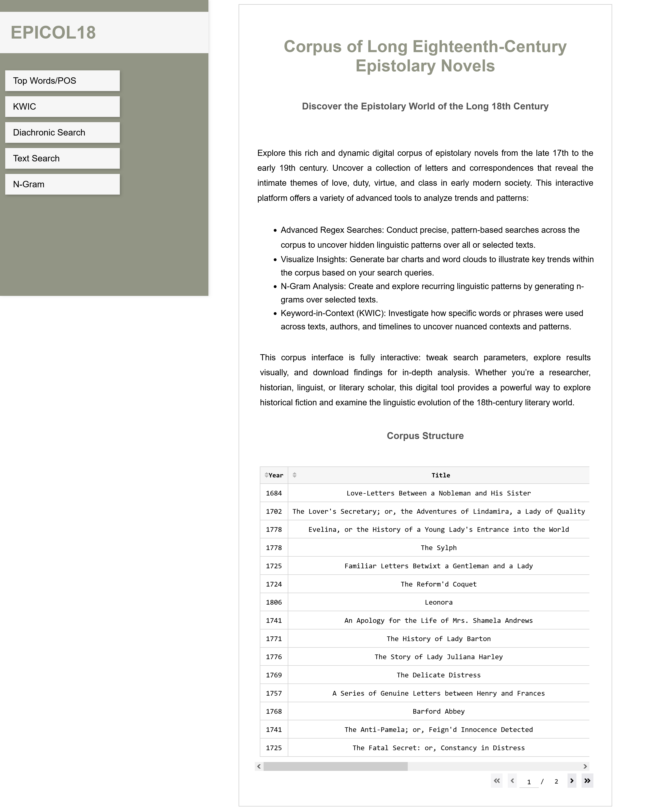
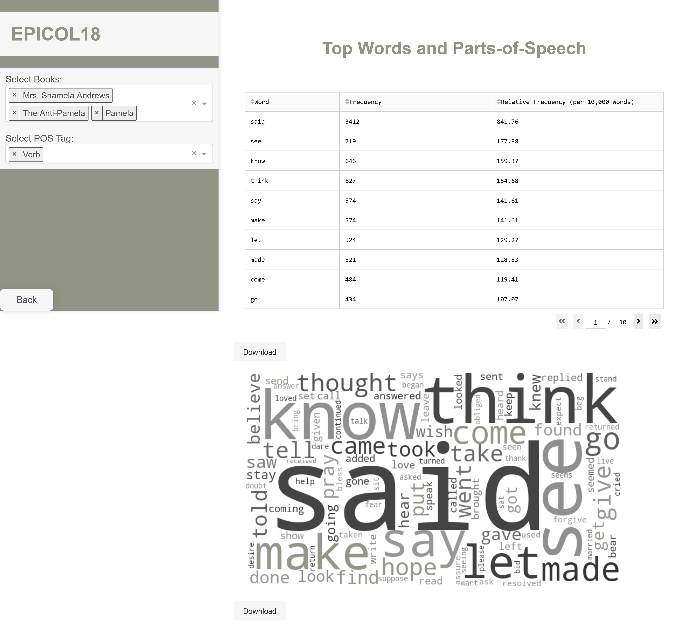
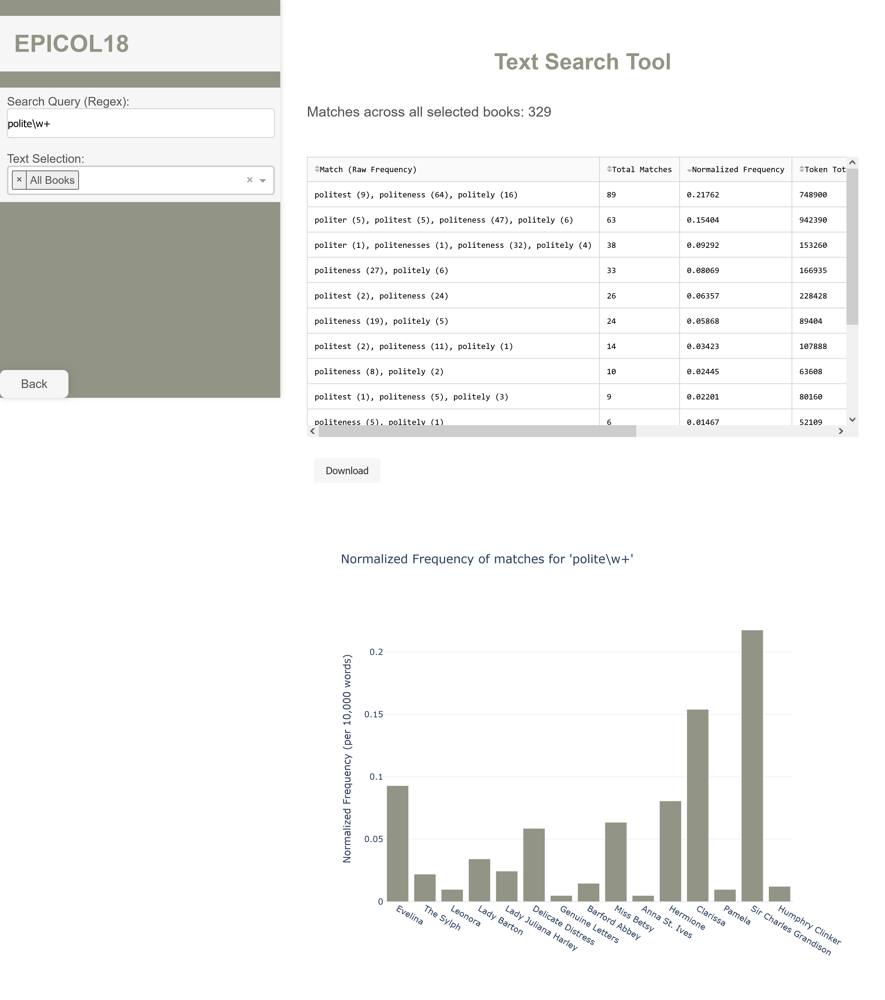
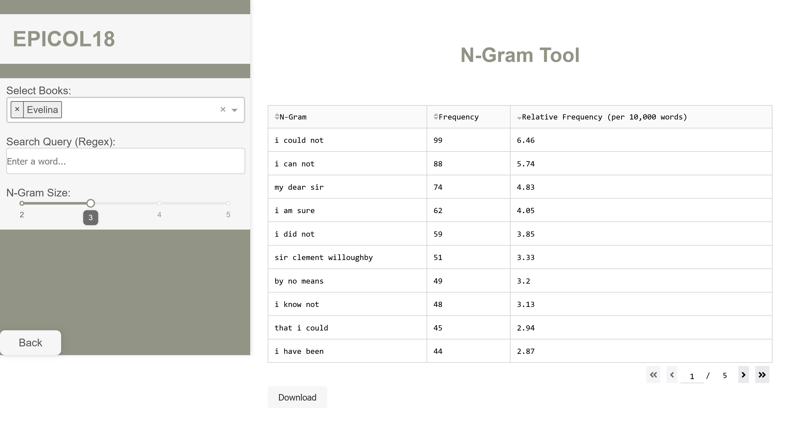
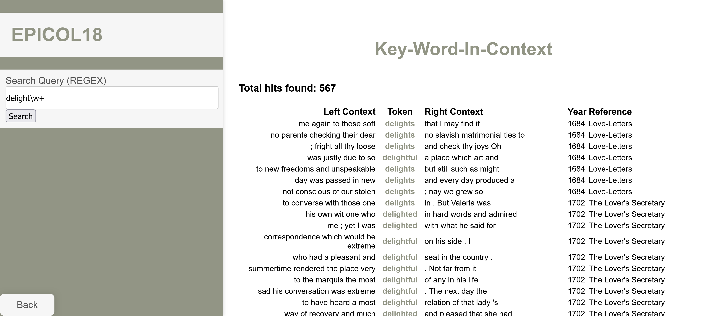

[Back](https://ycvogt.github.io/my_portfolio/)

# EPICOL18 - A linguistic corpus-interface to an 18th century epistolary novels corpus

 ~ Coming Soon: User Documentation Manual, detailed background with each text source and downloadable file/package on GitHub! ~ 

Epistolary Corpus of Long 18th Century Literature (EPICOL18) is now available with a corpus-interface programmed in Python and Dash that connects to a SQL Database of all texts.

This corpus comprises a collection of epistolary novels, published between the early 17th and 19th century. With this corpus-interface users can:

* Conduct Advanced Regex Searches: Conduct precise, pattern-based searches across the corpus to uncover hidden linguistic patterns over all or selected texts.
* Visualize Insights: Generate bar charts and word clouds to illustrate key trends within the corpus based on your search queries.
* N-Gram Analysis: Create and explore recurring linguistic patterns by generating n-grams over selected texts.
* Keyword-in-Context (KWIC): Investigate how specific words or phrases were used across texts, authors, and analyze timelines to uncover nuanced contexts and patterns.

Here are some first impressions:

[Back](https://ycvogt.github.io/my_portfolio/)
