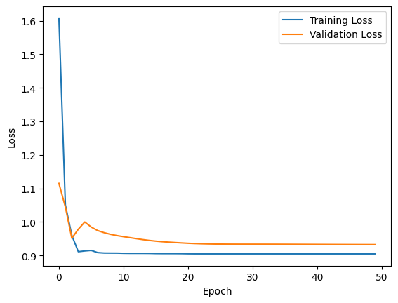
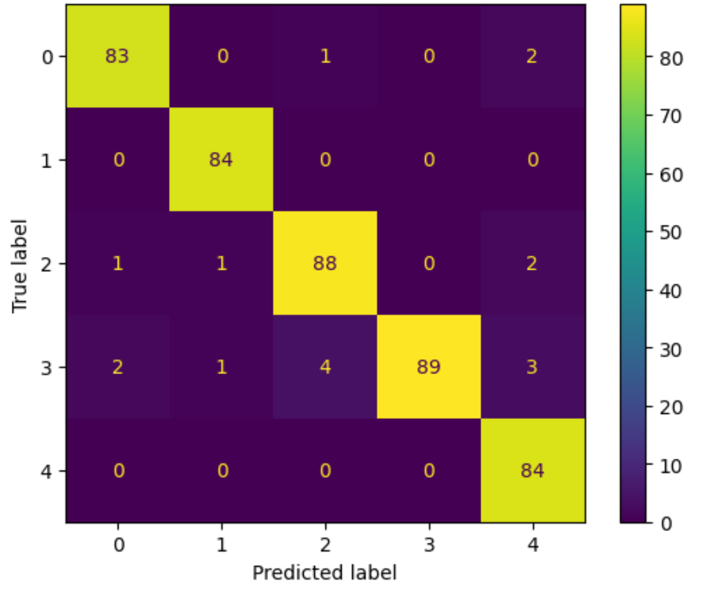

[Back](https://ycvogt.github.io/my_portfolio/)

# Machine Learning for Text Classification - BBC News

The aim of this project was to automatically classify _BBC News_ articles into 5 categories (_business_, _entertainment_, _politics_, _sport_, _tech_) according to their content.

**Skills**: machine learning, training/validation loss visualization, word embedding, text classification <br>
**Libraries**: pandas, numpy, matplotlib, pytorch, sklearn, plotly

---
### 1. Preparing Textual Data

After downloading the dataset BBC News Archive from Kaggle [1], I loaded it as a pandas dataframe. Afterwards, I would explore the datasets a bit to gain a sense of its size. This dataset consists of 2225 texts.

We can see in the first plot that most categories have approximately the same amount of words, except for _business_ (~15%). However, in terms of number of texts, _tech_ counts the lowest number of texts (n=224), as shown in the second plot. In the third plot we can see the average length of texts (measured in number of words/tokens) per category. This shows us that the longest texts are in _politics_ and _tech_, and shorter texts are in _business_, _sport_ and _entertainment_.

<iframe src="images/ml_class/overview_words_category.html" width="100%" height="400px" style="border:none;"></iframe>

<iframe src="images/ml_class/texts_categories.html" width="100%" height="400px" style="border:none;"></iframe>

<iframe src="images/ml_class/overview_texts_categories.html" width="100%" height="400px" style="border:none;"></iframe>


Next, I split it into training, validation, and test sets:

```python
from sklearn.model_selection import train_test_split

X_train, X_test, y_train, y_test = train_test_split(data["content"], data["category"], test_size=0.2, random_state=1)

X_train, X_val, y_train, y_val = train_test_split(X_train, y_train, test_size=0.25, random_state=1)
```

Once this was done, I would encode the labels and vectorize the the text:

```python
le =LabelEncoder()
le.fit(y_train)
print(le.classes_)
train_y=le.transform(y_train)
val_y=le.transform(y_val)
test_y=le.transform(y_test)
```

```python
vectorizer = CountVectorizer()
vectorizer.fit_transform(X_train)
train_x=vectorizer.transform(X_train)
val_x=vectorizer.transform(X_val)
test_x=vectorizer.transform(X_test)
```

Finally, I just convert all my data sets into tensors for the model:

```python
train_x_tensor=torch.tensor(train_x.toarray()).float()
train_y_tensor=torch.tensor(train_y)

val_x_tensor=torch.tensor(val_x.toarray()).float()
val_y_tensor=torch.tensor(val_y)

test_x_tensor=torch.tensor(test_x.toarray()).float()
test_y_tensor=torch.tensor(test_y)
```

### 2. My ML Model

```
class ClassificationNet(nn.Module):

    def __init__(self):
        super(ClassificationNet, self).__init__()
        self.layers = nn.Sequential(
        nn.Linear(23699, 512), #feature number, first layer size
        nn.Hardtanh(),
        nn.Linear(512,5) # we have 5 categories!
        )

    def forward(self, x): #forward pass
        sm = nn.Softmax(dim=1) #activation function
        x = sm(self.layers(x))
        return x

net = ClassificationNet()

lrt=0.01 # learning rate
optimizer = optim.Adam(net.parameters(), lr=lrt) # optimizer
criterion = nn.CrossEntropyLoss() # loss/criterion
epochs = 50 # epochs / number of training iterations
```

### 3. Training

```
train_err=[]
val_err =[]

for i in range(epochs):

    optimizer.zero_grad() # zero the gradients
    output = net(train_x_tensor)  # calculate output
    loss = criterion(output, train_y_tensor) # calculate loss
    loss.backward() # use loss to compute gradients
    optimizer.step() # apply optimizer to update weights

    with torch.no_grad():

        output_val= net(val_x_tensor)  # compute output
        loss_val = criterion(output_val, val_y_tensor) # compute loss
        predict_y= [np.argmax(i.detach().numpy()) for i in output_val] # compute prediction
```

The following image shows how well our model performs, i.e. whether it struggles with over-/under-fitting or neither:



It turns out, it works pretty well! There is no great difference between validation and training loss and there is a clear, steep learning curve. 

### 4. Evaluation

```
with torch.no_grad():
    # compute the output
    output_test= net(test_x_tensor)

    # compute the prediction
    predict_test_y= [np.argmax(i.detach().numpy()) for i in output_test]

    # eval function for accuracy, f1 
    accuracy,f1=evaluation_metrics(predict_test_y,test_y_tensor)
    print('Accuracy: %.3f f1: %.3f'% (accuracy,f1))
```


My model achieved an accuracy of approx. 97% and an f1 score of approx. 0.97 as well! The confusion matrix shows that most labels are correctly predicted (i.e. true positives and true negatives). As a result, it can automatically (and quite accurately) classify a text of the BBC Archive as belonging into one of the five categories _business_, _entertainment_, _politics_, _sport_, _tech_.


__References__: <br>
[1] Dataset: https://www.kaggle.com/datasets/hgultekin/bbcnewsarchive (last accessed Sept. 12, 2024).<br>
Please note that parts of this project were re-used and slightly adapted from previous assignments completed for university.

[Back](https://ycvogt.github.io/my_portfolio/)
