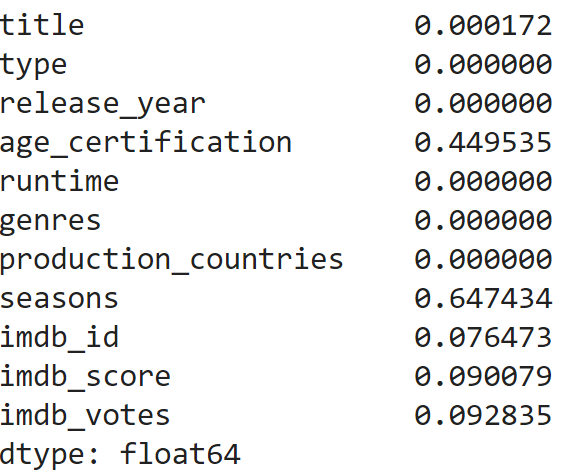

[Back](https://ycvogt.github.io/my_portfolio/)

# Netflix Series and Movies Analysis

In this project I analyse and visualize core trends and distributions of a Netflix Series and Movies dataset in Python with the pandas and plotly libraries.

**Libraries**: pandas, numpy, matplotlib, plotly <br>
**Dataset**: The dataset was downloaded from Kaggle[1].

---

## 1. Setup and preliminary exloration
First, we load the dataset and the libraries. Next, we read in the file as a dataframe:

```
df = pd.read_csv('imdb_movies_shows.csv', encoding="UTF-8")
```

The data set (first lines) looks like this:
<iframe src="images/movies/table1.html" width="100%" height="400px" style="border:none;"></iframe>

Next, we get an idea of its size:
```
df.size #number of datapoints
```
```
df.shape #number of rows, columns 
```
```
df.columns #column names
```

This dataset has 63866 datapoints, 5806 rows and 11 columns with the names: ```title```, ```type```, ```release_year```, ```age_certification```, ```runtime```, ```genres```, ```production_countries```, ```seasons```, ```imdb_id```, ```imdb_score```, ```imdb_votes```. 

Subsequently, we want to check the datapoints themselves, i.e. are there any missing values? We can do this with: 
``` 
df.isnull().sum() / len(df)
```


There are many missing values in ```age_certification``` (45%) and ```seasons``` (65%), and a few in ```title``` (0.2%),```imdb_id``` (8%), ```imdb_score``` (9%), and ```imdb_votes``` (9%).

## 2. Cleaning and preprocessing

Cleaning and preprocessing involves removing columns that I will not consider for further analysis, and subsetting data such that missing values are removed. 

```
columns_remove = ["age_certification", "seasons", "imdb_id", "imdb_votes"] 
df = df.drop(columns=columns_remove) #remove columns that are not relevant

df['imdb_score'] = df['imdb_score'].fillna(0) #clean and make columns uniform, especially how they show empty values

#filter out rows in with missing values
imdb_score_filtered = df.loc[df["imdb_score"] > 0.0, ["title", "type", "release_year", "runtime", "genres", "production_countries", "imdb_score"]]
pcountries_filtered = imdb_score_filtered.loc[imdb_score_filtered["production_countries"] != "[]", ["title", "type", "release_year", "runtime", "genres", "production_countries", "imdb_score"]]
clean_df = pcountries_filtered.loc[pcountries_filtered["title"] != np.NaN, ["title", "type", "release_year", "runtime", "genres", "production_countries", "imdb_score"]]#0 in title, and [] in genres, thus same length
clean_df = clean_df.loc[clean_df["genres"] != "[]",["title", "type", "release_year", "runtime", "genres", "production_countries", "imdb_score"]]
clean_df
```

After cleaning and preprocessing, we have a reduced set of 35763 datapoints and the following dataset:
<iframe src="images/movies/table2.html" width="100%" height="400px" style="border:none;"></iframe>


As both columns ```genres``` and ```production_countries``` have multiple values assigned, I split them up and assigned them to a new row for every value. This way, a movie/show that can be categorized into multiple genres/is produced in multiple countries, receives multiple rows. I saved this as a new dataframe in order to keep it separate from the original, comprehensive version.

```
import re
new_df = clean_df.assign(genres=clean_df.genres.str.split(", ")).explode('genres')
new_df['genres'] = new_df['genres'].str.rstrip("]").str.lstrip("[").str.strip("'")
new_df
```
```
newest_df = new_df.assign(production_countries=clean_df.production_countries.str.split(", ")).explode('production_countries')
newest_df['production_countries'] = newest_df['production_countries'].str.rstrip("]").str.lstrip("[").str.strip("'")
newest_df
```
_Note: The replace method did not work for me, so this was my work-around. There may be more efficent ways to clean the resulting column values._

## 3. Analysis

From the first overview, we can see that most titles are modern, from around 2017-2021. There are many ways to plot this, but I decided for a plotly violin plot, as I have not used one before:

```
import plotly.express as px
fig = px.violin(clean_df, x="release_year")
fig.show()
```

<iframe src="images/movies/violin.html" width="100%" height="400px" style="border:none;"></iframe>

While there are many datapoints, there are not many movies and shows that are older than 2010. Most movies and shows in this dataset are recent. We can also quickly find the exact release year of the oldest and newest films with ```df['release_year'].min()```, which returns 1945, and ```df['release_year'].max()```, which returns 2022.

Next, I explored more involved variable combinations:


**How many movies and shows are there in percent?** 
```
fig = px.histogram(clean_df, x="type", histnorm = "percent", width=500)
fig.show()
```
<iframe src="images/movies/bar1.html" width="100%" height="400px" style="border:none;"></iframe>
Movies make up 65% and shows take up 35% of the dataset.


**How many movies and shows were released per year?** 
```
fig = px.histogram(clean_df, x="release_year", histnorm = "percent", color="type", width = 900)
fig.show()
```
<iframe src="images/movies/bar3.html" width="100%" height="400px" style="border:none;"></iframe>
This shows the same distribution as the violin plot above. Most movies and shows are from 2017-2022.


**How are genres distributed among movies and shows?**
```
fig = px.histogram(new_df, x="genres", histnorm = "percent", color="type")
fig.show()
```
<iframe src="images/movies/bar4.html" width="100%" height="400px" style="border:none;"></iframe>
Drama is the most frequent genre, followed by comedy, thriller and action. Interestingly, reality as a genre is purely restricted to shows, and sci-fi, crime, fantasy, family and animation are predominatly also present in the form of shows. Note that one movie can be represented in mulitple of these categories.


**What is the average IMDB-Score for movies and shows? Which category has a higher IMDB-Score on average?** 
```
fig = px.histogram(clean_df, x="type", y="imdb_score", histfunc="avg", width=500)
fig.show()
```
<iframe src="images/movies/bar10.html" width="100%" height="400px" style="border:none;"></iframe>
It seems that shows have a higher IMDB score on average.


**What is the average IMDB-Score per genre and type?**
```
fig = px.histogram(new_df, x="genres", y="imdb_score", color="type", histfunc='avg')
fig.show()
```
<iframe src="images/movies/bar5.html" width="100%" height="400px" style="border:none;"></iframe>
In terms of movies, documentaries have the highest IMDB-Scores on average (6.9) and shows of the genre history (7.5).


**What is the average IMDB-Score per production country and type?** 
```
fig = px.histogram(newest_df, x="production_countries", y="imdb_score", color = "type", histfunc='avg', width=2000)
fig.show()
```
<iframe src="images/movies/bar6.html" width="100%" height="400px" style="border:none;"></iframe>
While this is a nice visualization to play with, I cannot right away see which country has the highest average score in movies/shows, so I do this:
```
country_imdb = newest_df.groupby(["production_countries", "type"])["imdb_score"].mean().sort_values(ascending=False)
country_imdb
```
These are the results (snippet of the highest-scoring ones):<br>
CL	SHOW	8.500000<br>
CU	MOVIE	8.300000<br>
BS	MOVIE	8.000000<br>
HU	SHOW	7.900000<br>
PT	SHOW	7.850000<br>
<br>
... and the lowest-scoring ones:<br>
CM	MOVIE	4.800000<br>
JO	SHOW	4.150000<br>
AO	MOVIE	3.900000<br>
CY	MOVIE	2.900000<br>

If we remove ```type```from the group-by statement above, we can get the average IMDB-Score per country overall, which results in the follwing countries with the hightest IMDB-Scores:<br>
CU	8.300000<br>
BS	8.000000<br>
AF	7.700000<br>
CD	7.700000<br>


**Which country produced the most movies/shows?**
```
fig = px.histogram(newest_df, x="production_countries", color = "type", histnorm = "percent", width=1800)
fig.show()
```
<iframe src="images/movies/bar8.html" width="100%" height="400px" style="border:none;"></iframe>
This shows us that most shows and movies are produced in the US and that those make up most of the dataset in total. This dataset predominantly includes shows from Japan and Great Britain rather than movies, while it mostly includes movies from India rather than shows.

References

[1] Data was downloaded from: <https://www.kaggle.com/datasets/maso0dahmed/netflix-movies-and-shows?resource=download> (last accessed July 2024).

---

[Back](https://ycvogt.github.io/my_portfolio/)
