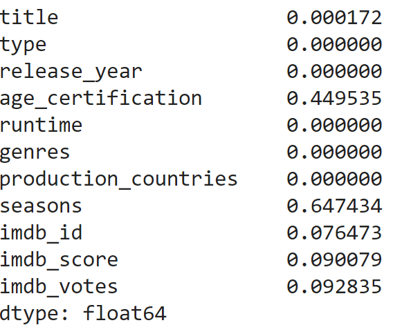
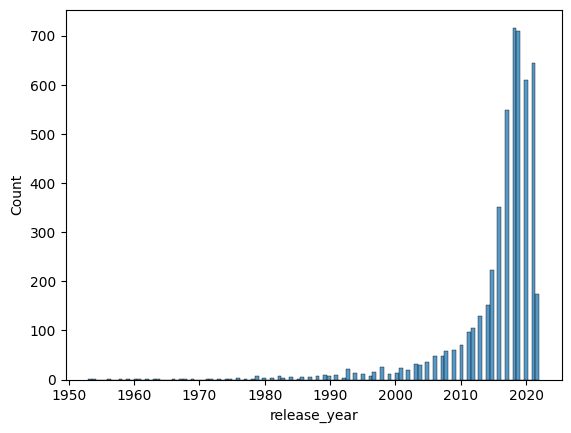

[Back](https://ycvogt.github.io/my_portfolio/)

# Netflix Series and Movies Analysis

Dataset: The dataset was downloaded from Kaggle[1].

Libraries: pandas, numpy, matplotlib, bokeh, seaborn


## Setup and preliminary exloration
First, we load the dataset and the libraries. Next, we read in the file as a dataframe.

```
df = pd.read_csv('imdb_movies_shows.csv', encoding="UTF-8")
```

The data set looks like this:

<iframe src="images/table1_movies.html" width="100%" height="400px" style="border:none;"></iframe>

Next, we get an idea of its size:


Number of datapoints:
```
df.size
```

Number of rows, columns: 
```
df.shape
```

Column names: 
```
df.columns
```


This dataset has 63866 datapoints, 5806 rows and 11 columns with the names: ```title```, ```type```, ```release_year```, ```age_certification```, ```runtime```, ```genres```, ```production_countries```, ```seasons```, ```imdb_id```, ```imdb_score```, ```imdb_votes```. 

Subsequently, we want to check the datapoints themselves, i.e. are there any missing values? We can do this with: 
``` 
df.isnull().sum() / len(df)
```



There are many missing values in ```age_certification``` and ```seasons```, and a few in ```title```,```imdb_id```, ```imdb_score```, and ```imdb_votes```.

## Cleaning and preprocessing

Cleaning and preprocessing involves removing columns that I will not consider for further analysis, and subsetting data such that missing values are removed. 

```
#remove columns that are not relevant
columns_remove = ["age_certification", "seasons", "imdb_id", "imdb_votes"]
df = df.drop(columns=columns_remove)
#clean and make columns uniform, especially how they show empty values
df['imdb_score'] = df['imdb_score'].fillna(0)
imdb_score_filtered = df.loc[df["imdb_score"] > 0.0, ["title", "type", "release_year", "runtime", "genres", "production_countries", "imdb_score"]]
pcountries_filtered = imdb_score_filtered.loc[imdb_score_filtered["production_countries"] != "[]", ["title", "type", "release_year", "runtime", "genres", "production_countries", "imdb_score"]]
clean_df = pcountries_filtered.loc[pcountries_filtered["title"] != np.NaN, ["title", "type", "release_year", "runtime", "genres", "production_countries", "imdb_score"]]#0 in title, and [] in genres, thus same length
clean_df.size #get new number after cleaning
```

After cleaning and preprocessing, we have a reduced set of 35791 datapoints and the following dataset:

<iframe src="images/table2_movies.html" width="100%" height="400px" style="border:none;"></iframe>


## Analysis

From the first overview, we can see that most titles are modern, from around 2017-2021.

```
sns.histplot(x='release_year', data=clean_df)
```



```
import plotly.express as px
fig = px.violin(clean_df, x="release_year")
fig.show()
```

<iframe src="images/violin.html" width="100%" height="400px" style="border:none;"></iframe>

While there are many datapoints, there are not many movies and shows that are older than 2010. Most movies and shows in this dataset are recent. 

A breakdown can be created thus:

```
clean_df['release_year'].value_counts(normalize=True)
```


References

[1] https://www.kaggle.com/datasets/maso0dahmed/netflix-movies-and-shows?resource=download
