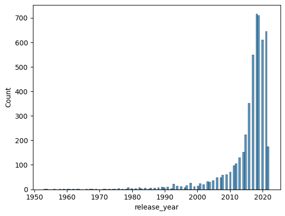

[Back](https://ycvogt.github.io/my_portfolio/)

# Netflix Series and Movies Analysis

**Project**: Analyse and Visualize core trends and distributions in this dataset in python with plotly.

**Dataset**: The dataset was downloaded from Kaggle[1].

**Libraries**: pandas, numpy, matplotlib, plotly

## Setup and preliminary exloration
First, we load the dataset and the libraries. Next, we read in the file as a dataframe.

```
df = pd.read_csv('imdb_movies_shows.csv', encoding="UTF-8")
```

The data set looks like this:

<iframe src="images/movies/table1_movies.html" width="100%" height="400px" style="border:none;"></iframe>

Next, we get an idea of its size:


```
df.size #number of datapoints
```
```
df.shape #number of rows, columns 
```
```
df.columns #column names
```

This dataset has 63866 datapoints, 5806 rows and 11 columns with the names: ```title```, ```type```, ```release_year```, ```age_certification```, ```runtime```, ```genres```, ```production_countries```, ```seasons```, ```imdb_id```, ```imdb_score```, ```imdb_votes```. 

Subsequently, we want to check the datapoints themselves, i.e. are there any missing values? We can do this with: 
``` 
df.isnull().sum() / len(df)
```


There are many missing values in ```age_certification``` and ```seasons```, and a few in ```title```,```imdb_id```, ```imdb_score```, and ```imdb_votes```.

## Cleaning and preprocessing

Cleaning and preprocessing involves removing columns that I will not consider for further analysis, and subsetting data such that missing values are removed. 

```
columns_remove = ["age_certification", "seasons", "imdb_id", "imdb_votes"] 
df = df.drop(columns=columns_remove) #remove columns that are not relevant

df['imdb_score'] = df['imdb_score'].fillna(0) #clean and make columns uniform, especially how they show empty values

#filter out rows in with missing values
imdb_score_filtered = df.loc[df["imdb_score"] > 0.0, ["title", "type", "release_year", "runtime", "genres", "production_countries", "imdb_score"]]
pcountries_filtered = imdb_score_filtered.loc[imdb_score_filtered["production_countries"] != "[]", ["title", "type", "release_year", "runtime", "genres", "production_countries", "imdb_score"]]
clean_df = pcountries_filtered.loc[pcountries_filtered["title"] != np.NaN, ["title", "type", "release_year", "runtime", "genres", "production_countries", "imdb_score"]]#0 in title, and [] in genres, thus same length
clean_df = clean_df.loc[clean_df["genres"] != "[]",["title", "type", "release_year", "runtime", "genres", "production_countries", "imdb_score"]]
clean_df
```

After cleaning and preprocessing, we have a reduced set of 35763 datapoints and the following dataset:
<iframe src="images/movies/table2_movies.html" width="100%" height="400px" style="border:none;"></iframe>

As both columns ```genres``` and ```production_countries``` have multiple values assigned, I split them up and assigned them to a new row for every value. This way, a movie/show that can be categorized into multiple genres/is produced in multiple countries, receives multiple rows. I saved this as a new dataframe in order to keep it separate from the original, comprehensive version.

```
import re
new_df = clean_df.assign(genres=clean_df.genres.str.split(", ")).explode('genres')
new_df['genres'] = new_df['genres'].str.rstrip("]").str.lstrip("[").str.strip("'")
new_df
```
```
newest_df = new_df.assign(production_countries=clean_df.production_countries.str.split(", ")).explode('production_countries')
newest_df['production_countries'] = newest_df['production_countries'].str.rstrip("]").str.lstrip("[").str.strip("'")
newest_df
```
Note: The replace method did not work for me, so this was my work-around. There may be more efficent ways to clean the resulting column values.

## Analysis

From the first overview, we can see that most titles are modern, from around 2017-2021. There are many ways to plot this, but I decided for a bar plot in seaborn and plotly violin plot, as I have not used one before:
```
sns.histplot(x='release_year', data=clean_df)
```


```
import plotly.express as px
fig = px.violin(clean_df, x="release_year")
fig.show()
```
<iframe src="images/movies/violin.html" width="100%" height="400px" style="border:none;"></iframe>

While there are many datapoints, there are not many movies and shows that are older than 2010. Most movies and shows in this dataset are recent. We can also quickly find the exact release year of the oldest and newest films with ```df['release_year'].min()```, which returns 1945, and ```df['release_year'].max()```, which returns 2022.

Next, I explored more involved variable combinations:

```
fig = px.histogram(clean_df, x="type", histnorm = "percent", width=500)
fig.show()
```
<iframe src="images/movies/bar1.html" width="100%" height="400px" style="border:none;"></iframe>
```
fig = px.histogram(clean_df, x="type", y="imdb_score", histfunc="avg", width=500)
fig.show()
```
<iframe src="images/movies/bar10.html" width="100%" height="400px" style="border:none;"></iframe>
```
fig = px.histogram(clean_df, x="release_year", histnorm = "percent", color="type", width = 900)
fig.show()
```
<iframe src="images/movies/bar3.html" width="100%" height="400px" style="border:none;"></iframe>
```
fig = px.histogram(new_df, x="genres", histnorm = "percent", color="type")
fig.show()
```
<iframe src="images/movies/bar4.html" width="100%" height="400px" style="border:none;"></iframe>
```
fig = px.histogram(new_df, x="genres", y="imdb_score", color="type", histfunc='avg')
fig.show()
```
<iframe src="images/movies/bar5.html" width="100%" height="400px" style="border:none;"></iframe>
```
fig = px.histogram(newest_df, x="production_countries", y="imdb_score", color = "type", histfunc='avg', width=2000)
fig.show()
```
<iframe src="images/movies/bar6.html" width="100%" height="400px" style="border:none;"></iframe>
```
fig = px.histogram(newest_df, x="production_countries", color = "type", histnorm = "percent", width=1800)
fig.show()
```
<iframe src="images/movies/bar8.html" width="100%" height="400px" style="border:none;"></iframe>


References

[1] <https://www.kaggle.com/datasets/maso0dahmed/netflix-movies-and-shows?resource=download>
