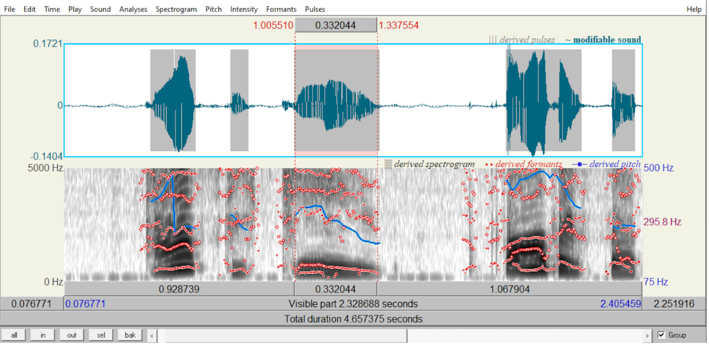
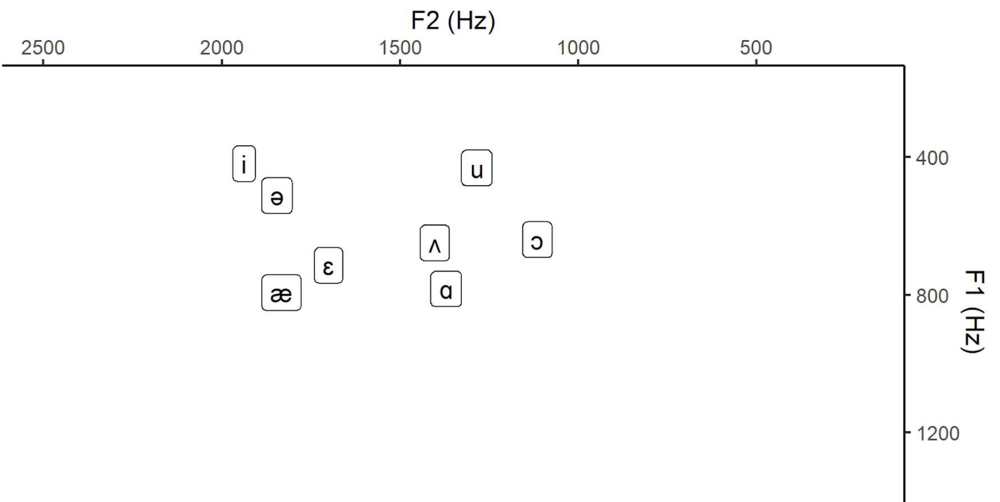
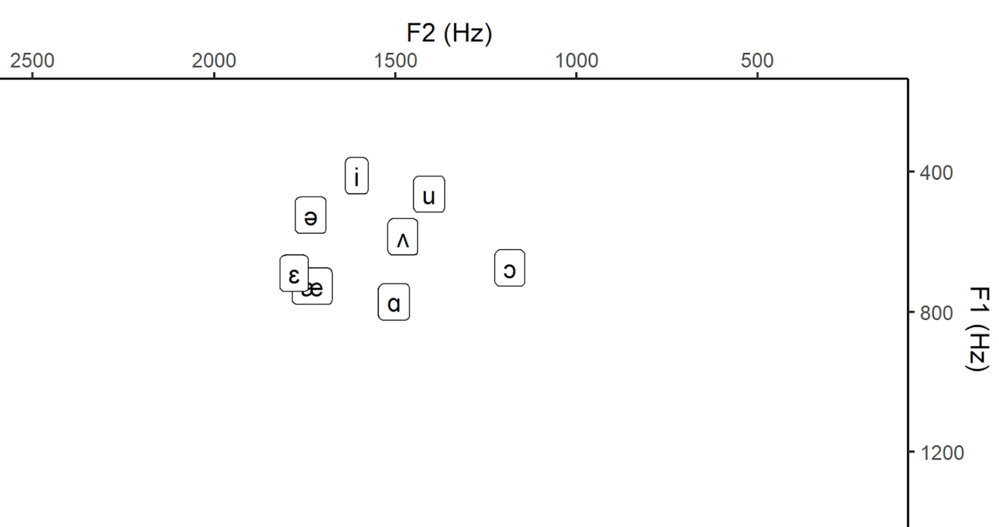

[Back](https://ycvogt.github.io/my_portfolio/)

## Vowel Formant Frequency Alterations as Voice Disguise Strategy 

A recent project of mine for university explored the change of first and second formants in vowels as a means of voice disguise strategy. For the analysis part I utilized _Praat_[1] and _R_[2]. In the following, I used excerpts from this paper (for the full paper, please contact me).

### Praat

After visually identifying the relevant segments with the aid of the spectrogram (this takes some knowledge of phonetics and how specific sounds look like in a spectrogram), I zoomed in to select the exact vowel segment. This segment was then measured for the average F1 and F2 values. According to Davenport and Hannahs [3], it is specifically the "relative positions of the first and second formants (F1 and F2) are characteristic of specific vowels". While the F1 formant represents tongue height, the F2 formant represents backness or frontness [4].

This amounted to 352 data points in total, based on which the mean and average values of F1 and F2 formants for each vowel were calculated. This data was then read into R and vowel charts were created. The data consists of 8 vowels which were measured for 10 participants. Those were measured for F1 and F2 values once for regular and once for disguised voice modes. In Images 1-2 below, I selected the sound [i] as in the word _tea_. 


Image 1: Selecting the relevant segment. My own voice recording disguised.


Image 2: Measuring F1 and F2 values. My own voice recording disguised.

### Analysis in R and Visualizations

First, I import the libraries:

```
library(dplyr)
library(ggplot2)
```

Next, I load the data for the normal voice mode and plotted the vowel chart (a common way of displaying vowel frequencies):
```
##load data
my_data <- read.table(file="D:/Uni/Master/Semester_8/VA/Results.txt", header=TRUE, sep="\t", encoding="UTF-8")
print(my_data)

#get mean of value of each vowel
means <- my_data%>%group_by(VOWEL)%>%summarise(mean_F1 = mean(F1),mean_F2 = mean(F2))

#plot the data points as vowel chart and reverse the axes
ggplot(means, aes(x = mean_F2, y = mean_F1, label= VOWEL)) + 
  geom_label() + 
  expand_limits(x=c(200,2500), y=c(200, 1500)) +
  labs(y = "F1 (Hz)", x = "F2 (Hz)") +
  scale_y_reverse(position = "right")+
  scale_x_reverse(position = "top") +
  theme_classic()
```


Image 3: Vowel Chart Normal Voice Mode.

The same was repeated for the disguised voice mode:

```
##load data
my_data_disguised <- read.table(file="D:/Uni/Master/Semester_8/VA/Results_disguised.txt", header=TRUE, sep="\t", encoding="UTF-8")
print(my_data_disguised)

#get mean of value of each vowel
means_d <- my_data_disguised%>%group_by(VOWEL)%>%summarise(mean_F1_d = mean(F1),mean_F2_d = mean(F2))

#plot the data points as vowel chart and reverse the axes
ggplot(means_d, aes(x = mean_F2_d, y = mean_F1_d, label= VOWEL)) + 
  geom_label() + 
  expand_limits(x=c(200,2500), y=c(200, 1500)) +
  labs(y = "F1 (Hz)", x = "F2 (Hz)") +
  scale_y_reverse(position = "right")+
  scale_x_reverse(position = "top") +
  theme_classic()
```


Image 4: Vowel Chart Disguised Voice Mode.

### Findings 

What we can see here is that there is a change in F1 and F2 frequencies. However, in order to conclusively link this to a change in vowel position in the mouth (i.e. a change in pronunciation) further measurement techniques would be necessary (e.g. MRI Imaging or electropalatography). 

---
### References

[1]Boersma, Paul & Weenink, David (2024). Praat: doing phonetics by computer [Computer program]. Version 6.3.17, retrieved 21 August 2024 from http://www.praat.org/. <br/>
[2]RStudio Team (2024). RStudio: Integrated Development for R. RStudio, PBC, Boston, MA URL http://www.rstudio.com/.<br/>
[3]Davenport, M., & Hannahs, S.J. (2010). Introducing Phonetics and Phonology (3rd ed.). Routledge. https://doi.org/10.4324/9780203785447.<br/>
[4]Hansen Edwards, J. G. (2023). The Sounds of English Around the World: An Introduction to Phonetics and Phonology. Cambridge: Cambridge University Press.<br/>

A great overview on how to make such vowel charts in _R_ are shown by Joey Stanley:<br/>
https://joeystanley.com/blog/making-vowel-plots-in-r-part-1/<br/>
https://joeystanley.com/blog/making-vowel-plots-in-r-part-2/

[Back](https://ycvogt.github.io/my_portfolio/)
