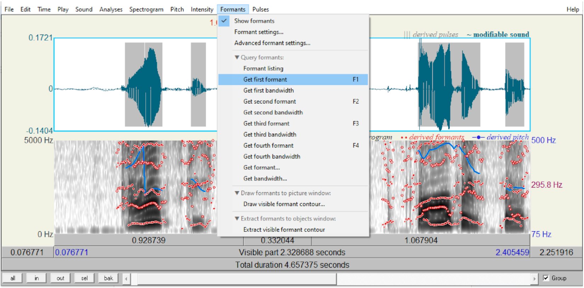
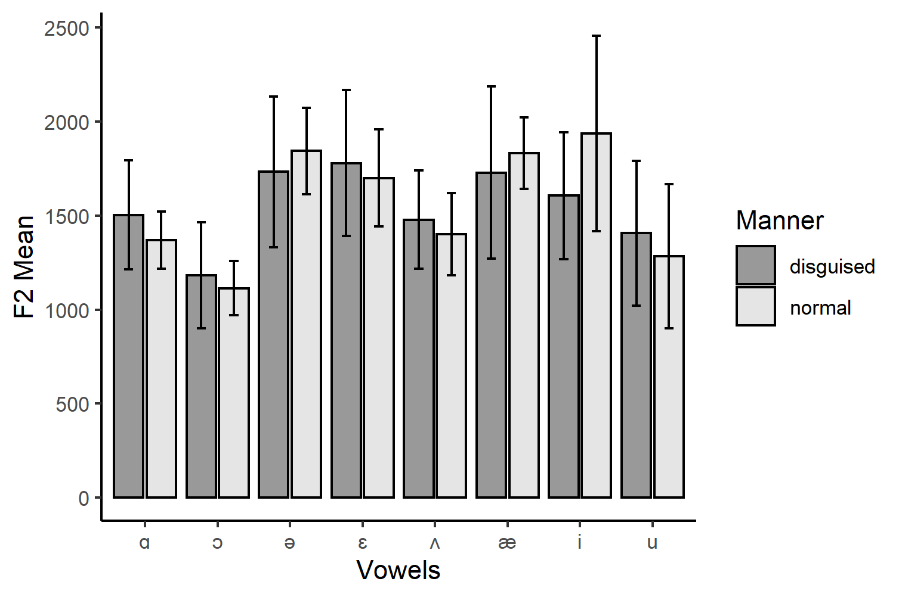

[Back](https://ycvogt.github.io/my_portfolio/)

##  Measuring and Visualizing Vowel Formant Frequency Alterations as Voice Disguise Strategy

A recent project of mine* explored the change of first and second formants in vowels as a means of voice disguise strategy, in addition to fundamental frequency alterations (see [Hypothesis & Significance Testing: Fundamental Frequency Alterations ](/my_portfolio/posts/praat_vowels1_2.html)). 

**Libraries**: dplyr, ggplot2
**Dataset**: EGG and microphone recordings of University of Zurich student participants

---

We conducted an experiment in our Phonetics Lab at university, recording every participant with a regular microphone and an electroglottograph (EGG). The participants (n=11) were prompted to read a text consisting of twelve sentences once in a ’normal’ voice and once in a ’disguised voice’ that should render them unrecognizable, even for people who know them well. They were not given any input as to what the strategy might entail to avoid any interference with their ad hoc solution to disguise their voice. I will only report on the acoustic data here. The data was analysed in _Praat_ [1] and visualized in _R_ [2]. The first part of the research question was as follows: Inhowfar do adult women employ alteration in the first two formants (F1, F2) as a voice disguise strategy?

Based on this research question, I could formulate the following hypotheses:

* H0: There is no difference between normal and disguised vowels in the participants' F1 and F2 formant freuquencies in continuous speech based on acoustic measures.
* H1: There is a difference between normal and disguised vowels in the participants' F1 and F2 formant frequencies in continuous speech based on acoustic measures.

### 1. Measurement of F1 & F2 Formants in _Praat_

Once the data was collected, I opened the audio files in _Praat_. After visually identifying the relevant segments with the aid of the spectrogram (this takes some knowledge of phonetics and how specific sounds look like in a spectrogram), I zoomed in to select the exact vowel segment. This segment was then measured for the average F1 and F2 values. According to Davenport and Hannahs [3], it is specifically the "relative positions of the first and second formants (F1 and F2) are characteristic of specific vowels". While the F1 formant represents tongue height, the F2 formant represents backness or frontness [4].

This amounted to 352 data points in total, based on which the mean and average values of F1 and F2 formants for each vowel were calculated. This data was then read into R and vowel charts were created. The data consists of 8 vowels: the cardinal vowels: _tea_ /i/, _father_ /&#593;/, _fed_ /&#603;/, _food_ /u/, _bought_ /&#596;/; the closest approximant to the fourth cardinal vowel (CV4), _cat_ /&aelig;/; and two extra central vowels _the_ /&#601;/, _some_ /&#652;/.

Those vowels were measured for F1 and F2 values once for regular and once for disguised voice modes for all 10 participants. In Images 1-2 below, I selected the sound /i/ as in the word _tea_. 


Image 1: Selecting the relevant segment. My own voice recording disguised.


Image 2: Measuring F1 and F2 values. My own voice recording disguised.

### 2. Data Analysis in R

I used the following code to create the mean/standard deviation for the bar plot, after loading the libraries ```dplyr``` and ```ggplot2``` and reading in the files:
```
##get stats from data
stats_df <- my_data%>%group_by(VOWEL)%>%
  summarise(mean_F1 = round(mean(F1),digits=2), mean_F2 = round(mean(F2),digits=2), stdev_f1 = round(sd(F1),digits=2), stdev_F2 = round(sd(F2),digits=2))%>%as.data.frame()
stats_df$Manner <- "normal"
stats_disguise_df <- my_data_disguised%>%group_by(VOWEL)%>%
  summarise(mean_F1 = round(mean(F1),digits=2), mean_F2 = round(mean(F2),digits=2), stdev_f1 = round(sd(F1),digits=2), stdev_F2 = round(sd(F2),digits=2))%>%as.data.frame()
stats_disguise_df$Manner <- "disguised"

#merge the two dataframes
final_df <- rbind(stats_df, stats_disguise_df)
print(final_df)

#plot the data
ggplot(final_df, aes(x=VOWEL, y=mean_F1, fill=Manner, color=Manner))+
         geom_bar(stat="identity", color="black", position = position_dodge2(preserve = "single"), alpha=0.5)+
         geom_errorbar(aes(ymin=mean_F1-stdev_f1, ymax=mean_F1+stdev_f1), width=0.25, colour="black", position = position_dodge(width=0.9)) +
  theme_classic() +
  labs(x="Vowels", y="F1 Mean")+ 
  scale_fill_grey()
#repeat for the F2 values!
```

Image 3: F1 Mean Values with Standard Deviation for Normal and Disguised Mode.


Image 4: F2 Mean Values with Standard Deviation for Normal and Disguised Mode.

We can see in Images 3-4 how much the data spreads around the average values for each vowel. For example, we can see that the datapoints spread quite widely for the F1 and F2 formants. This may be due to the diverse linguistic background of speakers, causing a generally greater dispersion of pronouncing English sounds. It could als be due to the general idiosyncracies of the speakers or problems during measurement. I would argue, however, that there is a certain trend: The disguised standard deviations are greater than those those of the normal voice modes. This would need further verfication, but if we follow this idea, this could imply that changing your voice results across all participants in much more variability than when comparing participants vowel pronunciations in a normal mode. However, this is where the descriptive statistics' powers end. If we wanted to know more about the potential significance between them, we would have to use either the standard error or confidence intervals as error bars. Or, we conduct some significance testing.

### 3. Visual Analysis in R (Vowel Charts)

As we deal with vowels, we could now further visualize the tongue-position that the participants adopt on average for each vowel. We use the same libraries and load the data and plot the vowel chart (a common way of displaying vowel frequencies):
```
#get mean of value of each vowel
means <- my_data%>%group_by(VOWEL)%>%summarise(mean_F1 = mean(F1),mean_F2 = mean(F2))

#plot the data points as vowel chart and reverse the axes
ggplot(means, aes(x = mean_F2, y = mean_F1, label= VOWEL)) + 
  geom_label() + 
  expand_limits(x=c(200,2500), y=c(200, 1500)) +
  labs(y = "F1 (Hz)", x = "F2 (Hz)") +
  scale_y_reverse(position = "right")+
  scale_x_reverse(position = "top") +
  theme_classic()
```


Image 5: Vowel Chart Normal Voice Mode.

The same was repeated for the disguised voice mode.


Image 6: Vowel Chart Disguised Voice Mode.

### 4. Conclusion and Caveat

What we can see here is that there is a change in F1 and F2 frequencies. How signficant (or how big these changes are), would require some more statistical testing. The error bars in the data analysis do not allow any inferential interpretations, but rather display how much the data disperses around the mean values. As there is quite some dispersion, we should also only carefully interpret the final two images, as the mean is strongly affected by outliers. Moreover, in order to conclusively link this to a change in vowel position in the mouth (i.e. a change in pronunciation) further measurement techniques would be necessary (e.g. MRI Imaging or electropalatography). I hope that this could still nicely illustrate how useful vowel charts can be and how one can measure F1 and F2 values in _Praat_.

---
### References and Footnotes

*In this article, I used partly altered excerpts from this paper (for the full paper, please contact me).

[1] Boersma, Paul & Weenink, David (2024). Praat: doing phonetics by computer [Computer program]. Version 6.3.17, retrieved 21 August 2024 from [http://www.praat.org/](http://www.praat.org/).<br/>
[2] RStudio Team (2024). RStudio: Integrated Development for R. RStudio, PBC, Boston. Available at [http://www.rstudio.com/](http://www.rstudio.com/).<br/>
[3] Davenport, M., & Hannahs, S.J. (2010). Introducing Phonetics and Phonology (3rd ed.). Routledge. doi: [https://doi.org/10.4324/9780203785447](https://doi.org/10.4324/9780203785447).<br/>
[4] Hansen Edwards, J. G. (2023). The Sounds of English Around the World: An Introduction to Phonetics and Phonology. Cambridge: Cambridge University Press.<br/>

A great overview on how to make such vowel charts in _R_ is presented by Joey Stanley: [Part 1](https://joeystanley.com/blog/making-vowel-plots-in-r-part-1/), [Part 2](https://joeystanley.com/blog/making-vowel-plots-in-r-part-2/).

[Back](https://ycvogt.github.io/my_portfolio/)
