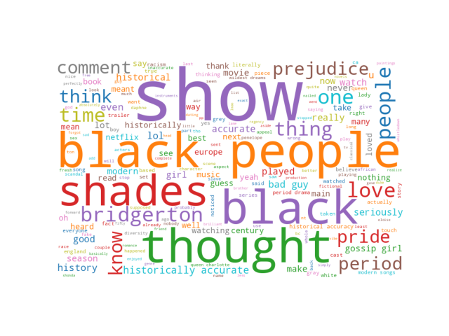
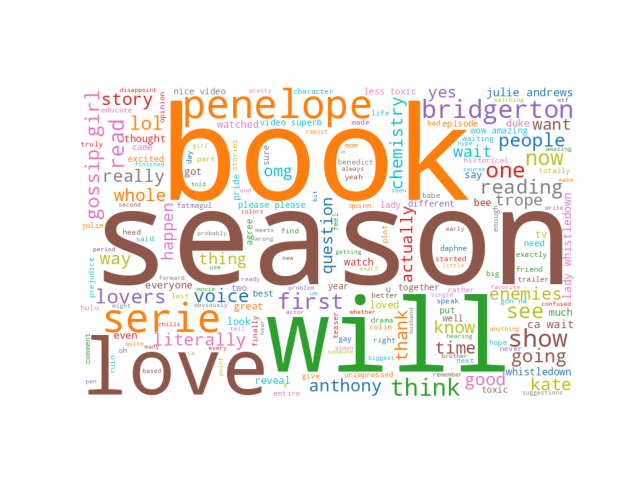
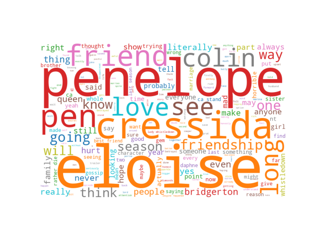
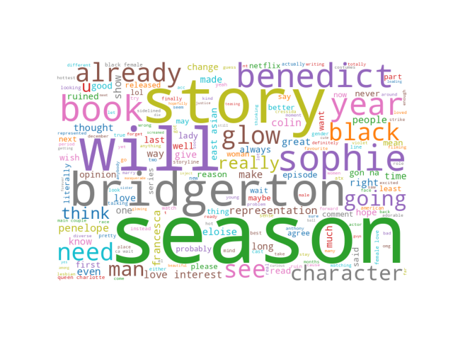
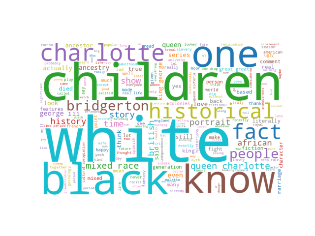

[Back](https://ycvogt.github.io/my_portfolio/)

# Unsupervised Sentiment Analysis of Bridgerton YouTube Trailer Comments

The popular Netflix Series "Bridgerton" (based on the novel series by Julia Quinn) seems to cause many emotions amongst viewers whenever new season trailers are released. What do people think about the different seasons based on the trailers? Let’s find out!

**Skills**: webscraping, data cleaning, social media opinion mining, NLP, unsupervised sentiment analysis<br/> 
**Libraries**: youtube-comment-downloader, pandas, spacy, emoji, transformers, wordcloud, plotly


(Almack's Assembly Rooms [1].)<br/> 

For this project, I first scraped the 200 most popular comments of each Netflix Bridgerton Series trailer on YouTube with the library ```youtube-comment-downloader``` [2]:

* **Season 1 Trailer**: https://www.youtube.com/watch?v=gpv7ayf_tyE
* **Season 2 Trailer**: https://www.youtube.com/watch?v=Bs9r1UbmFAI
* **Season 3 Trailer**: https://www.youtube.com/watch?v=U4JYAx5rNRA&pp=ygUcYnJpZGdlcnRvbiBzZWFzb24gMyB0cmFpbGVyIA%3D%3D
* **Season 4 Trailer**: https://www.youtube.com/watch?v=VGHJPpo2oeU
* **Queen Charlotte Trailer**: https://www.youtube.com/watch?v=oLtnNw0KT78

Here are code snippets of my project:

```
!pip install youtube-comment-downloader
!pip install emoji
import emoji
import spacy
from transformers import pipeline
import pandas as pd
from itertools import islice
from youtube_comment_downloader import *
downloader = YoutubeCommentDownloader()
nlp = spacy.load('en_core_web_sm')
```
```
#Season 1 (same for the other trailers)
s1 = []
comments_s1 = downloader.get_comments_from_url('https://www.youtube.com/watch?v=gpv7ayf_tyE', sort_by=SORT_BY_POPULAR)
for comment in islice(comments_s1,200):
    #print(comment)
    s1.append(comment)

df_s1 = pd.DataFrame(s1)
df_s1 = df_s1.drop(columns=['author', 'channel', 'cid', 'photo', 'heart', 'reply', 'time_parsed'], axis=1) #I am removing these for privacy reasons
```

Next, pre-processing was necessary: removing emojis and emoticons, punctuation, usernames, tokenizing, lowercasing, and shaping the comments into useful dataframes and as input to the model:

```
#Season 1 (same for the other trailers)
df_s1["text"] = df_s1["text"].apply(lambda x: emoji.replace_emoji(x, replace=""))
df_s1['text'] = df_s1['text'].str.replace('@[A-Za-z0-9]+\s?', '', regex=True)
df_s1['text_clean'] = df_s1['text'].apply(lambda x: [t.text.lower() for t in nlp.tokenizer(x) if not t.is_punct and t.is_alpha])

comment_s1_list = df_s1['text_clean'].tolist()
def edit_for_model(comment_list):
  comments = []
  for element in comment_list:
    element = " ".join(element)
    comments.append(element)
  return comments

comment_s1 = edit_for_model(comment_s1_list)
```

The dataset was now ready for the model to be predicted. I decided to use ```disilbert-base-uncased-emotion``` [3], as it offered a more fine-grained display of emotional categories ('sadness', 'joy', 'love', 'anger', 'fear', 'surprise') compared to the popular three-way distinction (positve, negative, neutral). The model assigned to every post a percentage of how likely each of these emotions are. I decided to keep all of them instead of choosing the most likely one (i.e. the one with the highest score), as this might help in some situations to represent a more nuanced picture of the user's sentiment. In addition, this model is trained on twitter data, which is fairly close to YouTube comments, as both are part of the wider social media register.

```
classifier = pipeline("sentiment-analysis",model='bhadresh-savani/distilbert-base-uncased-emotion', return_all_scores=True)
def sentiment(comments):
  results = []
  for c in comments:
    prediction = classifier(c, )
    [prediction] = prediction
    results.append(prediction)
  return results

results_s1 = sentiment(comment_s1)
```
<iframe src="images/sentiment_bridgerton/final_df.html" width="100%" height="400px" style="border:none;"></iframe>

Finally, I made some visualizations based on the results of the model:

<iframe src="images/sentiment_bridgerton/final_image.html" width="100%" height="400px" style="border:none;"></iframe><br/>

We an immediately see that the vast majority of all trailer comments reflect the emotion "joy". So far so good! However, we can also see that "anger" is equally present, with roughly a third of the comments reflecting this emotion. Especially season 3 seems to have stirred a lot of "anger". This might have to do with the changes that the directors made to the original book series by Julia Quinn, which would also explain the high number of comments relating to "surprise" - but this is just a guess. The users express the emotion of "love" in some way or another in all trailers more or less equally. "Sadness" finds the greatest expression in the spin-off Queen Charlotte, which might have to do with the sadness of the story. 

In order to learn more about the content of the comments, we need to look at some word-frequencies.


<br/>
(Season 1 Trailer Comments.)<br/>

In season 1, commentators were seemingly more focused on the cast and general changes to the original book series and it being presented as a show now. Comparisons are made to other series and movies such as _Pride and Prejudice_ or _50 Shades of Grey_. 

<br/>
(Season 2 Trailer Comments.)<br/>

Season 2 is more obsessed with the original book, referencing and predicting parts in the series, specifically the love story between Anthony and Kate. Comparisons are drawn to the romance genre and its tropes, as well as other shows like _Gossip Girl_.

<br/>
(Season 3 Trailer Comments.)<br/>

In the third season, there is a greater obsession with the relationships (see _friendship_, _friend_) between the characters, rather than the actors. Great focus is put on Penelope, Cressida and Eloise, and to a degree Collin. But it seems that commentators are more concerned with how the friendship unfolds rather than the romance.

<br/>
(Season 4 Trailer Comments.)<br/>

Season four seams to be a mix of season 2 and season 3. There is again a frequent reference back to the book series (_book_, _story_), and to the two main protagonists, Benedict and Sopie. Predictions are very present again as well as markers of opinion and evidentiality (_think_, _maybe_, _thought_). 

<br/>
(Queen Charlotte Trailer Comments.)<br/>

This series trailer is, similar to the first trailer, very interested in the cast and in how far the story was changed compared to the historical person of Queen Charlotte. 

### Caveats and Shortcomings

*  The model has a reported accuracy of 93.8 and F1-score of 93.79. However, the model does of course not always assign the most fitting category, e.g. "Gossip girl + pride and prejudice + 50 shades[...]" are classified as "angry", but "what a joke" is correctly identified as "angry". It is a bit hit and miss with sarcasm as well. This could be improved with some fine-tuning of the model, with a small share of the dataset that is manually labelled and that serves as the gold standard to the model. 
*  I only looked at the 200 most popular comments (high reply count and likes) of each trailer, amounting to 1000 comments. While this may give a good picture of the most prominent views, it is still excluding many smaller opinions that could shift some of the total counts/percentages. 
* The insights gained from this project are just based on the platform YouTube and do not account for the overall impression of these trailers in all social media. This is something to consider.

### References:

[1] "Almack's Assembly Rooms". Wikimedia Commons. https://commons.wikimedia.org/wiki/File:Almack%27s_Assembly_Rooms_inside.jpg (last accessed Sept 3, 2024).<br/> 
[2] https://pypi.org/project/youtube-comment-downloader<br/> (last accessed Sept 3, 2024).
[3] https://huggingface.co/bhadresh-savani/distilbert-base-uncased-emotion<br/> (last accessed Sept 3, 2024).

[Back](https://ycvogt.github.io/my_portfolio/)
