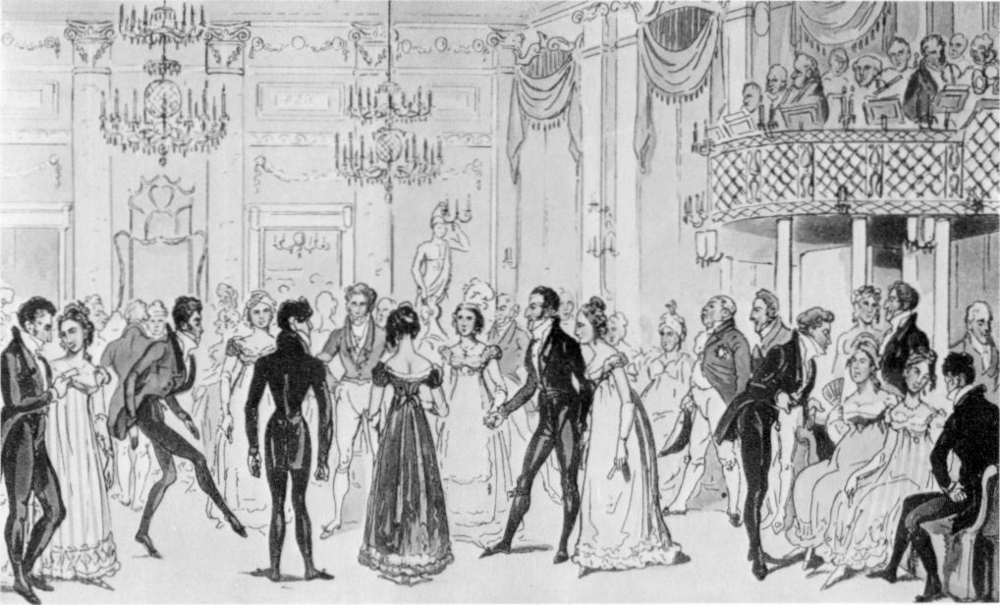

[Back](https://ycvogt.github.io/my_portfolio/)

# Unsupervised Sentiment Analysis of Bridgerton YouTube Trailer Comments

The popular Netflix Series "Bridgerton" (based on the novel series by Julia Quinn) seems to cause quite many emotions whenever new season trailers are released. What do people think about the different seasons based on their trailers? Let’s find out!

**Skills**: webscraping, data cleaning, social media opinion mining, NLP, unsupervised sentiment analysis<br/> 
**Libraries**: youtube-comment-downloader, pandas, spacy, emoji, transformers, wordcloud, plotly


[Almack's Assembly Rooms [1]]

For this project, I first scraped the 200 most popular comments with the library youtube-comment-downloader [2] for five of the Netflix Bridgerton Series trailers on YouTube.

* **Season 1 Trailer**: https://www.youtube.com/watch?v=gpv7ayf_tyE
* **Season 2 Trailer**: https://www.youtube.com/watch?v=Bs9r1UbmFAI
* **Season 3 Trailer**: https://www.youtube.com/watch?v=U4JYAx5rNRA&pp=ygUcYnJpZGdlcnRvbiBzZWFzb24gMyB0cmFpbGVyIA%3D%3D
* **Season 4 Trailer**: https://www.youtube.com/watch?v=VGHJPpo2oeU
* * **Queen Charlotte Trailer**: https://www.youtube.com/watch?v=oLtnNw0KT78

Here are code snippets of my project:

```
!pip install youtube-comment-downloader
!pip install emoji
import emoji
import spacy
from transformers import pipeline
import pandas as pd
from itertools import islice
from youtube_comment_downloader import *
downloader = YoutubeCommentDownloader()
nlp = spacy.load('en_core_web_sm')
```
```
#Season 1 (same for the other trailers)
s1 = []
comments_s1 = downloader.get_comments_from_url('https://www.youtube.com/watch?v=gpv7ayf_tyE', sort_by=SORT_BY_POPULAR)
for comment in islice(comments_s1,200):
    #print(comment)
    s1.append(comment)

df_s1 = pd.DataFrame(s1)
df_s1 = df_s1.drop(columns=['author', 'channel', 'cid', 'photo', 'heart', 'reply', 'time_parsed'], axis=1) #I am removing these for privacy reasons
```

Next, preprocessing was necessary: removing emojis and emoticons, punctuation, usernames, tokenizing, lowercasing, and shaping the comments into useful dataframes and as input to the model:

```
#Season 1 (same for the other trailers)
df_s1["text"] = df_s1["text"].apply(lambda x: emoji.replace_emoji(x, replace=""))
df_s1['text'] = df_s1['text'].str.replace('@[A-Za-z0-9]+\s?', '', regex=True)
df_s1['text_clean'] = df_s1['text'].apply(lambda x: [t.text.lower() for t in nlp.tokenizer(x) if not t.is_punct and t.is_alpha])

comment_s1_list = df_s1['text_clean'].tolist()
def edit_for_model(comment_list):
  comments = []
  for element in comment_list:
    element = " ".join(element)
    comments.append(element)
  return comments

comment_s1 = edit_for_model(comment_s1_list)
```

The dataset was now ready for the model to be predicted. I decided to use disilbert-base-uncased-emotion [3], as it offered a more fine-grained display of emotional categories ('sadness', 'joy', 'love', 'anger', 'fear', 'surprise') compared to the popular three-way distinction (positve, negative, neutral). The model assigned to every post a percentage of how likely each of these emotions are. I decided to keep all of them instead of choosing the most likely one (i.e. the one with the highest score), as this might help in some situations to represent a more nuanced picture of the user's sentiment. In addition, this model is trained on twitter data, which is fairly close to YouTube comments, as both are part of the wider social media register.

```
classifier = pipeline("sentiment-analysis",model='bhadresh-savani/distilbert-base-uncased-emotion', return_all_scores=True)
def sentiment(comments):
  results = []
  for c in comments:
    prediction = classifier(c, )
    [prediction] = prediction
    results.append(prediction)
  return results

results_s1 = sentiment(comment_s1)
```
<iframe src="images/sentiment_bridgerton/final_df.html" width="100%" height="400px" style="border:none;"></iframe>

Finally, I made some visualizations based on the results of the model:

<iframe src="images/sentiment_bridgerton/final_image.html" width="100%" height="400px" style="border:none;"></iframe><br>

#interpretation/findings


[Season 1 Trailer Comments]


[Season 2 Trailer Comments]


[Season 3 Trailer Comments]


[Season 4 Trailer Comments]


[Queen Charlotte Trailer Comments]

### Caveats and Shortcomings

*  The model has a reported accuracy of 93.8 and F1-score of 93.79. However, the model does of course not always assign the most fitting category, e.g. "Gossip girl + pride and prejudice + 50 shades[...]" are classified as "angry", but "what a joke" is correctly identified as "angry". It is a bit hit and miss with sarcasm as well. This could be improved with some fine-tuning of the model.
*  I only looked at the 200 most popular comments (high reply count and likes) of each trailer, amounting to 1000 comments. While this may give a good picture of the most prominent views, it is still excluding many smaller opinions that could shift some of the total counts/percentages. 
* The insights gained from this project are just based on the platform YouTube and do not account for the overall impression of these trailers in all social media. This is something to consider.

### References:

[1] "Almack's Assembly Rooms". Wikimedia Commons. https://commons.wikimedia.org/wiki/File:Almack%27s_Assembly_Rooms_inside.jpg (last accessed Sept 9, 2024).<br/> 
[2] https://pypi.org/project/youtube-comment-downloader<br/> 
[3] https://huggingface.co/bhadresh-savani/distilbert-base-uncased-emotion<br/> 

[Back](https://ycvogt.github.io/my_portfolio/)
